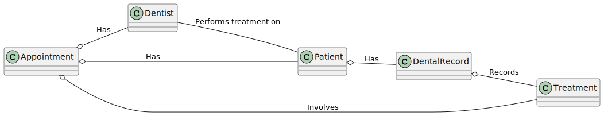
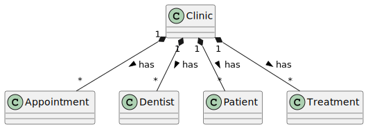

= Building the object model
:sectanchors:

To set up the data model for our Dental Clinic application, we'll create several Kotlin classes representing the domain entities like `Treatment`, `DentalRecord`, `Patient`, `Dentist`, `Appointment`, and `Clinic`.

== Treatment

Start by creating a `model` package inside the `DentalClinic` project in `src/main/kotlin`, e.g. `com.bpbonline.dentalclinic.model`. Inside this package, create a class `Treatment`:

[source,kotlin]
----
class Treatment(val id: String, val name: String, val duration: Int)
----

== DentalRecord

Then create a class `DentalRecord` that will represent the medical conditions and treatment history of each `Patient`:

[source,kotlin]
----
class DentalRecord(val patientId: String) {
    private val _treatmentHistory = mutableListOf<Treatment>()
    val medicalConditions = mutableListOf<String>()
    val treatmentHistory: List<Treatment>
        get() = _treatmentHistory

    fun addTreatment(treatment: Treatment) {
        _treatmentHistory.add(treatment)
    }
}
----

In `DentalRecord`, `_treatmentHistory` is a private mutable list which is a backing property. The `treatmentHistory` is a public immutable list that exposes the treatment history as read-only.

== Patient

Next, create a `Patient` class with both a primary and secondary constructor. This class will also have a `dentalRecord` property initialized with `lateinit`:

[source,kotlin]
----
class Patient(val id: String, val name: String) {
    var insurance: String? = null
    lateinit var dentalRecord: DentalRecord

    init {
        println("Patient Initialized with id: $id and name: $name")
    }

    constructor(id: String, name: String, insurance: String)
            : this(id, name) {
        println("Secondary constructor called. Insurance: $insurance")
        this.insurance = insurance
    }

    fun receiveTreatment(treatment: Treatment) {
        if (!::dentalRecord.isInitialized) {
            dentalRecord = DentalRecord(id)
        }
        println("Patient $name is receiving ${treatment.name}")
        dentalRecord.addTreatment(treatment)
        // additional code to handle the patient's response or actions
    }
}
----

== Dentist

Create the `Dentist` class with a private setter for the `treatmentCount` property:

[source,kotlin]
----
class Dentist(val id: String, val name: String) {
    var treatmentCount = 0
        private set

    fun performTreatment(patient: Patient, treatment: Treatment) {
        println("Performing ${treatment.name} on ${patient.name}")
        treatmentCount++
        // additional code to handle the treatment process
        patient.receiveTreatment(treatment)
    }
}
----

== Appointment

Subsequently, set up the `Appointment` class:

[source,kotlin]
----
class Appointment(
    val id: String,
    val patient: Patient,
    val dentist: Dentist,
    val time: LocalDateTime,
    val treatment: Treatment,
)
----

== Clinic

Lastly, create the `Clinic` class which includes services to schedule an appointment, as well as mutable maps to store instances of `Patient`, `Dentist`, `Treatment`, and `Appointment`:

[source,kotlin]
----
class Clinic {
    val patients = mutableMapOf<String, Patient>()
    val dentists = mutableMapOf<String, Dentist>()
    val treatments = mutableMapOf<String, Treatment>()
    val appointments = mutableListOf<Appointment>()

    fun addPatient(patient: Patient) = patients.put(patient.id, patient)
    fun addDentist(dentist: Dentist) = dentists.put(dentist.id, dentist)
    fun addTreatment(treatment: Treatment) = treatments.put(treatment.id, treatment)

    fun scheduleAppointment(patientId: String, dentistId: String, time: LocalDateTime, treatmentId: String) {
        val patient = patients[patientId]
            ?: throw IllegalArgumentException("Patient not found")
        val dentist = dentists[dentistId]
            ?: throw IllegalArgumentException("Dentist not found")
        val treatment = treatments[treatmentId]
            ?: throw IllegalArgumentException("Treatment not found")
        appointments.add(
            Appointment(
                UUID.randomUUID().toString(),
                patient,
                dentist,
                time,
                treatment,
            )
        )
    }
}
----

With these classes, you can now model different scenarios in your Dental Clinic application.

➡️ link:./4-data-classes.adoc[4. Data Classes]

⬅️ link:./2-prepare-kotlin-project.adoc[2. Prepare a Kotlin Project]