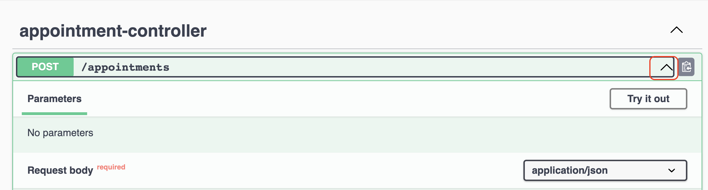

= Add Polymorphism
:sectanchors:

In this exercise, you will leverage polymorphism in DentalClinic's appointment scheduling system. This will involve setting up a REST API and interacting with it using Swagger.

== API Models and Service Interfaces

- Create a `com.bpbonline.dentalclinic.api.dto` package for Data Transfer Objects.
- Add `AppointmentDTOs.kt` Kotlin file to the package.

[source,kotlin]
----
data class AppointmentRequest(
    val patientId: String,
    val dentistId: String,
    val date: LocalDateTime,
    val treatmentType: String,
)

data class AppointmentResponse(
    val id: String? = null,
    val message: String,
)
----

- Create package `com.bpbonline.dentalclinic.service`.
- Add `AppointmentScheduler` interface in that package.

[source,kotlin]
----
interface AppointmentScheduler {
    fun schedule(
        appointmentRequest: AppointmentRequest,
    ): AppointmentResponse {
        return AppointmentResponse(
            id = UUID.randomUUID().toString(),
            message = successMessage()
        )
    }

    fun successMessage(): String
}
----

== Service Implementations

- Create a Spring service `DefaultAppointmentScheduler`, an implementation of `AppointmentScheduler` responsible for scheduling appointments on weekdays, in `com.bpbonline.dentalclinic.service.impl` package.

[source,kotlin]
----
@Service("defaultScheduler")
class DefaultAppointmentScheduler : AppointmentScheduler {
    override fun successMessage() = "Scheduled on a weekday!"
}
----

- Similarly, create a `WeekendAppointmentScheduler` for weekends.

[source,kotlin]
----
@Service("weekendScheduler")
class WeekendAppointmentScheduler : AppointmentScheduler {
    override fun successMessage() = "Scheduled on a weekend!"
}
----

== Implement the Controller

- Create a new package `com.bpbonline.dentalclinic.api.controller`, and within this package create `AppointmentController` class which represents a REST API controller for the appointments.

[source,kotlin]
----
@RestController
@RequestMapping("/appointments")
class AppointmentController(
    val appointmentSchedulers: List<AppointmentScheduler>,
) {
    @PostMapping
    fun scheduleAppointment(
        @RequestBody appointmentRequest: AppointmentRequest,
    ): ResponseEntity<AppointmentResponse> {
        val appointmentScheduler =
            findSchedulerFor(appointmentRequest.date)
        return ResponseEntity.ok(
            appointmentScheduler.schedule(
                appointmentRequest
            )
        )
    }

    private fun findSchedulerFor( // Determine the correct scheduler
        date: LocalDateTime,
    ): AppointmentScheduler {
        val weekend =
            listOf(DayOfWeek.SATURDAY, DayOfWeek.SUNDAY)
        return if (date.dayOfWeek in weekend) {
            appointmentSchedulers.first {
                it is WeekendAppointmentScheduler
            }
        } else {
            appointmentSchedulers.first {
                it is DefaultAppointmentScheduler
            }
        }
    }
}

----

== Integrate Swagger and run the app

- Update dependencies block in `build.gradle.kts` with:

[source,kotlin]
----
implementation("org.springdoc:springdoc-openapi-starter-webmvc-ui:2.2.0")
----

- Reload Gradle changes, e.g. by pressing the _Load Gradle Changes_ button.
- Start the `DentalClinicApplication.kt` application.
- Open http://localhost:8080/swagger-ui.html to view the Swagger UI for your appointments service.
- Expand the service and then click the _Try it out_ button, as illustrated in Figure 5.3.

- In the request body enter a random `patientId`, `dentistId` and `treatmentType`.
- Press _Execute_ button to observe the result.

This hands-on has demonstrated polymorphism by enabling the DentalClinic application to select different scheduling behaviors based on the date. By utilizing multiple implementations of the `AppointmentScheduler` interface and having the system decide at runtime which one to use, we have demonstrated a key principle of object-oriented programming.

➡️ link:./10-generics.adoc[10. Generics]

⬅️ link:./8-interfaces.adoc[8. Interfaces]
